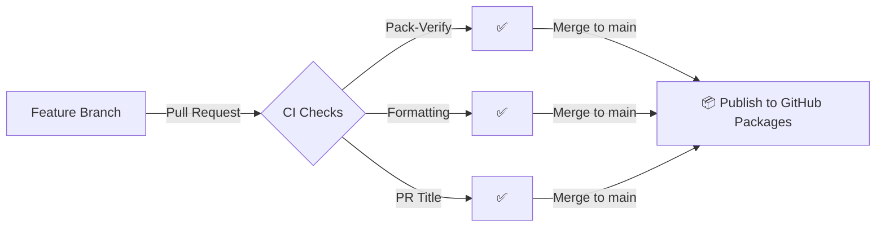

# Contributing

This repository follows trunk-based development. All changes go through pull requests to `main`.

## Contribution Checklist

- [ ] PR title follows [Conventional Commits](https://www.conventionalcommits.org/) (e.g., `feat: add option`, `fix: correct nesting`)
- [ ] ESLint passes: `npx eslint jquery.mjs.nestedSortable.js`
- [ ] Package builds: `nuget pack ProCoSys.jQuery.NestedSortable.nuspec`
- [ ] `<version>` in `ProCoSys.jQuery.NestedSortable.nuspec` bumped if publishing a new release

## Version Bumping

The package version lives in a single `<version>` element in [ProCoSys.jQuery.NestedSortable.nuspec](ProCoSys.jQuery.NestedSortable.nuspec). Bump that one value to release a new version.

On merge to `main`, the publish workflow packs and pushes to GitHub Packages. `--skip-duplicate` makes re-pushing an unchanged version a safe no-op, so unrelated merges don't fail.

## Publish Flow

